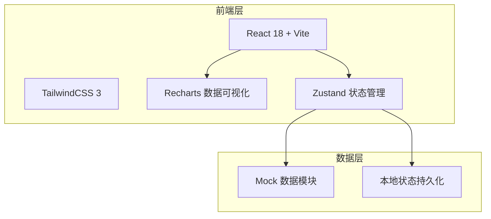
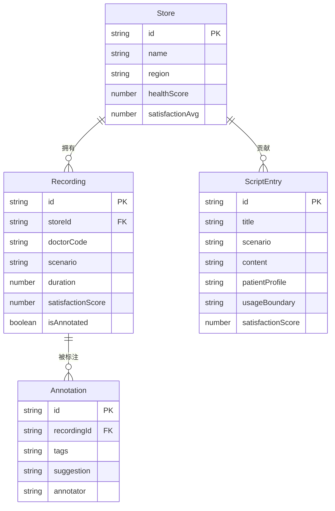

## 1. 架构设计



本项目为纯前端应用，不涉及后端服务。数据通过 Mock 模块模拟，状态通过 Zustand 管理，持久化至 localStorage。

## 2. 技术说明
- 前端框架：React 18 + TypeScript
- 样式方案：TailwindCSS 3
- 构建工具：Vite
- 数据可视化：Recharts
- 状态管理：Zustand（轻量级，适合中等复杂度应用）
- 路由：React Router v6
- 图标：Lucide React
- 字体：Noto Serif SC + Noto Sans SC（Google Fonts）
- 数据层：Mock 数据模块，模拟接诊记录、标签、门店、话术库等数据
- 后端：无（纯前端演示）
- 数据库：无（使用 localStorage 持久化用户操作数据）

## 3. 路由定义
| 路由 | 用途 |
|------|------|
| / | 看板首页，全局数据概览 |
| /annotation | 话术标签标注页，录音质检与标签标注 |
| /comparison | 门店对比页，趋势与典型案例对比 |
| /library | 优秀话术库页，高满意度话术浏览与引用 |

## 4. API定义
本项目无后端API，所有数据通过 Mock 模块提供。关键数据结构如下：

```typescript
interface Recording {
  id: string
  storeId: string
  storeName: string
  doctorId: string
  doctorCode: string
  patientType: string
  scenario: ScenarioType
  duration: number
  date: string
  satisfactionScore: number
  isAnnotated: boolean
}

type ScenarioType = 'implant' | 'orthodontic' | 'pediatric' | 'cleaning'

interface Annotation {
  id: string
  recordingId: string
  tags: TagType[]
  suggestion: string
  annotator: string
  createdAt: string
}

type TagType =
  | 'price_unclear'
  | 'risk_informed'
  | 'followup_missing'
  | 'overpromise'
  | 'empathy_good'
  | 'child_comfort'
  | 'urgency_appropriate'
  | 'consent_unclear'
  | 'value_demonstrated'
  | 'referral_missed'

interface Store {
  id: string
  name: string
  region: string
  healthScore: number
  weeklyAnnotationCount: number
  weeklyIssueCount: number
  satisfactionAvg: number
}

interface ScriptEntry {
  id: string
  title: string
  scenario: ScenarioType
  content: string
  patientProfile: string
  usageBoundary: string
  satisfactionScore: number
  referenceCount: number
  tags: TagType[]
  storeId: string
  createdAt: string
}
```

## 5. 服务器架构图
不适用，本项目为纯前端应用。

## 6. 数据模型

### 6.1 数据模型定义



### 6.2 数据定义语言
使用 TypeScript 接口定义数据结构，Mock 数据模块初始化时生成约 50 条录音记录、30 条标注记录、15 条优秀话术条目、6 家门店数据。数据持久化至 localStorage，标注操作实时更新本地存储。
